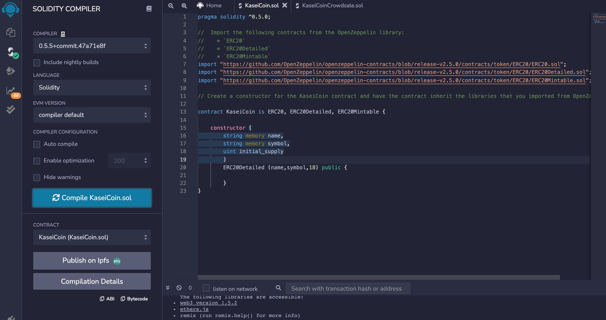
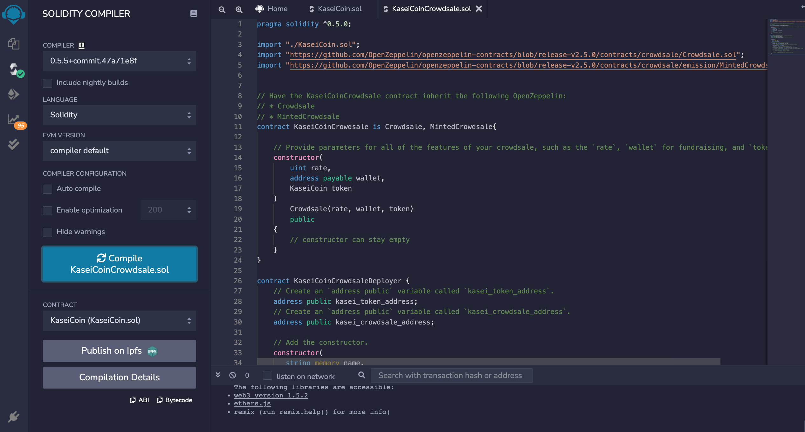
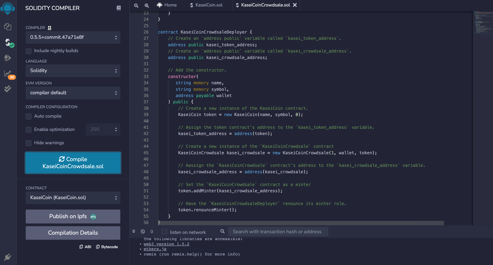
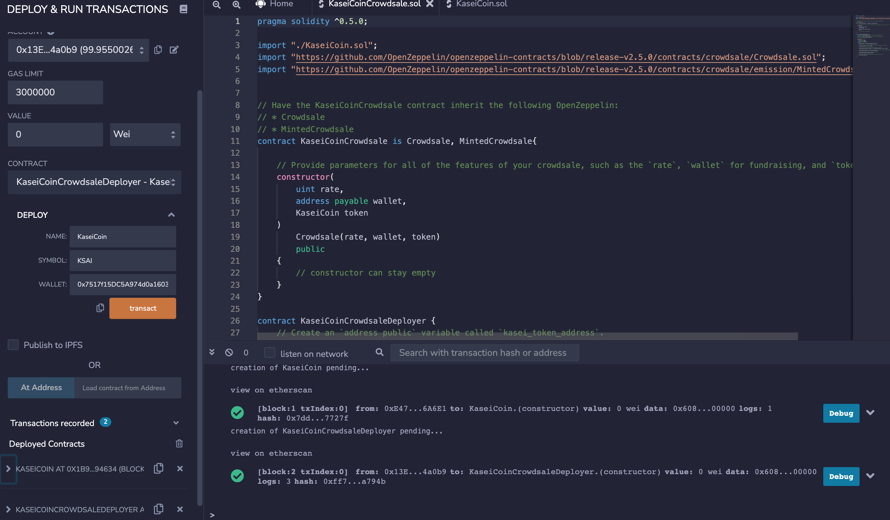
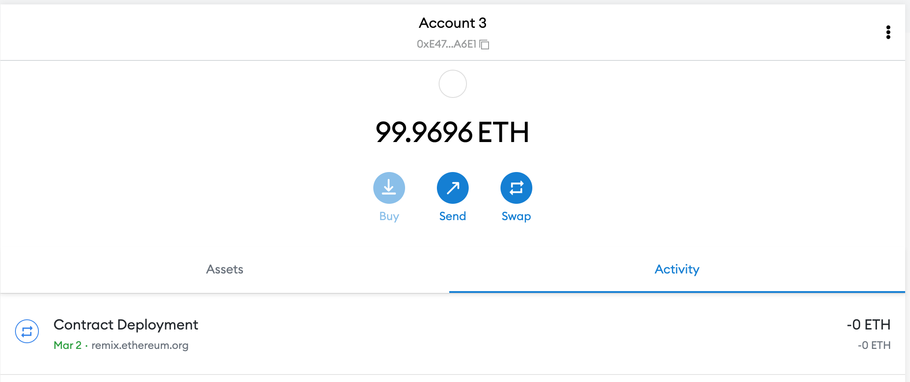
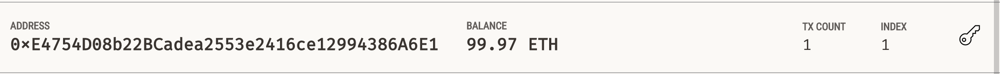
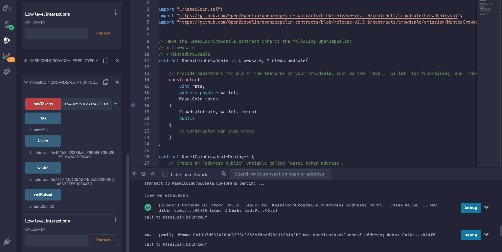

# **Crowdsale_Smart_Contracts**

This purpose of this project is to create a fungible token that is ERC-20 compliant and that will be minted by using a Crowdsale contract from the OpenZeppelin Solidity library.

The crowdsale contract that you create will manage the entire crowdsale process, allowing users to send ether to the contract and in return receive KAI, or KaseiCoin tokens. Your contract will mint the tokens automatically and distribute them to buyers in one transaction.

---

## **Technologies**

This program is written in Solidity using Remix IDE.  

To run this you will need to open the KaseiCoinCrowdsale.sol file in Remix.etherium.org which will lead to a Remix IDE screen.  

You can open the KaseiCoinCrowdsale.sol file in that system to buy tokens and crowdsale.

1. Compiled KaseiCoin Token Contract

2. Compiled KaseiCoin Crowdsale Contract

3. Compiled KaseiCoin Crowdsale Deployer Contract

4. REMIX Confirmation of Successful Deployment of KaseiCoin Crowdsale Deployer Contract

5. Metamask Confirmation of Successful Deployment of KaseiCoin Crowdsale Deployer Contract

6. Ganache Confirmation of Successful Deployment of KaseiCoin Crowdsale Deployer Contract

7. Confirmation of BuyToken feature and Wei raised

---

## **Contributors**

The author of this application is Kanika Sharma with Github username kinsnik, who also goes by Niki. She can be reached at ksharmaconnect3@gmail.com or on LinkedIn under Kanika Sharma: https://www.linkedin.com/in/kanika-sharma-aa28a6134/.

---

## **License**

Users have permissions to read this file, but not write or edit the code. The code within, if used, should be properly recognized and cited as the intellectual property of the author. 
